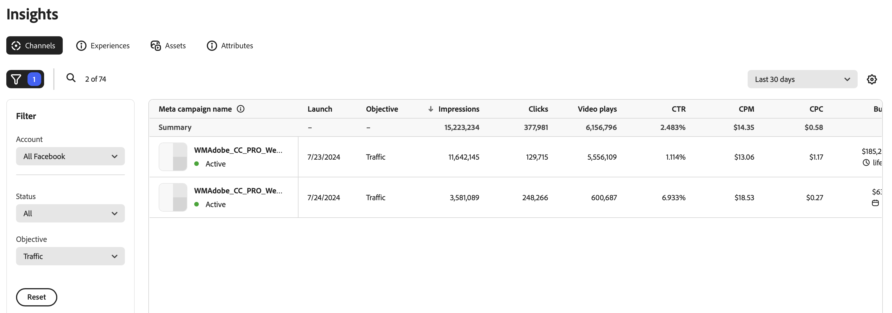

# Panoramica dei canali

La visualizzazione [!DNL Insights] _[!UICONTROL Canali]_ mostra un elenco di campagne per l&#39;account annuncio canale connesso.

>[!TIP]
>
>Per iniziare a ricevere i dati, GenStudio for Performance Marketers richiede la connessione a un account di canale. Consulta [Connetti account canale](connect-channel.md).

La tabella [!UICONTROL Canali] è organizzata utilizzando la campagna pubblicitaria basata su canale. L&#39;icona del filtro (funnel) sopra il lato sinistro della tabella apre il menu **[!UICONTROL Filtro]** in cui è possibile selezionare gli elenchi [!UICONTROL Account], [!UICONTROL Stato] e [!UICONTROL Obiettivo] per filtrare le campagne nella tabella.

Quando selezioni una campagna, si apre la scheda [!UICONTROL Esperienze] in un elenco di nomi di annunci associati alla campagna.

## Obiettivi

Al momento della creazione di una campagna con i Meta Ads, potresti aver selezionato un obiettivo in linea con i tuoi obiettivi aziendali. In GenStudio sono visibili sei obiettivi dei Meta Ads per gli addetti al marketing delle prestazioni:

1. **Consapevolezza**: raggiungi il pubblico più vasto e sensibilizza la tua azienda.
1. **Traffico**: aumenta il traffico verso il sito o l&#39;applicazione.
1. **Coinvolgimento**: interagire con clienti esistenti e potenziali.
1. **Lead**: crea connessioni per espandere il pubblico.
1. **Promozione app**: promuovi la tua applicazione.
1. **Vendite**: concentrati su come raggiungere le persone che probabilmente useranno il tuo prodotto.

## Metriche

A seconda degli obiettivi di prestazioni, le metriche di Insights possono aiutarti a valutare se stai raggiungendo il tuo obiettivo.

Ad esempio, se l&#39;obiettivo è la consapevolezza, un aumento del tasso di `impressions` potrebbe indicare l&#39;espansione della portata. Per capire se questo sta raggiungendo il tuo obiettivo, puoi guardare le metriche che indicano che il tuo contenuto è coinvolgente, come `clicks` o `video plays`. In che modo il pubblico interagisce efficacemente con i contenuti?

### Dettagli delle metriche

La tabella seguente fornisce definizioni e informazioni approfondite per le metriche chiave del marketing digitale nella vista Canali. Ogni metrica include una breve definizione relativa ai canali, del modo in cui viene calcolata e una o più informazioni per comprenderne il significato e l’impatto sulle campagne di marketing.

| Metrica | Definizione | Insight |
| ----------- | ----------------------------- | -------------------------------- |
| **[!UICONTROL Lancio]** | La data in cui la campagna è stata rilasciata o pubblicata sul mercato. | Un conteggio elevato delle impression può indicare che l’annuncio sta raggiungendo il pubblico previsto. |
| **[!UICONTROL Impression]** | Le impression vengono conteggiate ogni volta che il contenuto viene caricato sullo schermo, indipendentemente dall’interazione o dalla visualizzazione. | Un conteggio elevato delle impression può indicare un’ampia visibilità, ma per informazioni approfondite sulle prestazioni, considera con altre metriche di coinvolgimento. |
| **[!UICONTROL Clic]** | Numero di volte in cui gli utenti interagiscono con un elemento cliccabile, ad esempio un collegamento o un annuncio. | Un numero elevato di clic indica un forte interesse e coinvolgimento per il contenuto, che può essere efficace e raggiungere il pubblico giusto. |
| **[!UICONTROL CTR]** | Percentuale (%) di utenti che hanno fatto clic su un annuncio, un risultato di ricerca o collegamenti all’interno di un messaggio e-mail. **Calcolo**: `clicks` diviso per `impressions` | Un elevato tasso di click-through indica che il contenuto è altamente pertinente e motivante per il pubblico nella messaggistica e nella progettazione, e sta mirando in modo efficace agli interessi del pubblico. |
| **[!UICONTROL CPM]** | Misurazione delle prestazioni per il costo ($) per mille ad impression. **Calcolo**: importo totale `spent` diviso per la portata, quindi moltiplicato per 1000 | Un valore basso può indicare una visibilità a costi contenuti, soprattutto se associata a un elevato tasso di click-through. |
| **[!UICONTROL CPC]** | Costo medio ($) associato a ogni clic in un’esperienza. **Calcolo**: importo totale `spent` diviso per `clicks` | Costi medi più bassi possono indicare una spesa pubblicitaria efficiente in termini di costi, soprattutto se confrontata con un aumento delle conversioni. |
| **[!UICONTROL Riproduzioni video]** | Percentuale di spettatori che hanno guardato un video fino alla fine. | Un numero elevato di riproduzioni video può indicare che il video sta catturando l’attenzione e può indicare che la miniatura, il titolo o il posizionamento stanno effettivamente disegnando negli spettatori. Tassi elevati di completamento della riproduzione suggeriscono che il contenuto video è coinvolgente e rilevante. |
| **[!UICONTROL Budget]** | Totale dei fondi ($) assegnati a una campagna pubblicitaria per raggiungere gli obiettivi della campagna. | Un bilancio elevato implica maggiori risorse per una portata più ampia e un impatto potenzialmente maggiore. |
| **[!UICONTROL Spesa]** | L&#39;importo speso dal bilancio in un determinato periodo di tempo. | Un importo di spesa elevato in un breve periodo può indicare un utilizzo rapido, che potrebbe portare a un precoce esaurimento delle risorse. Monitora l’importo della spesa rispetto alle metriche delle prestazioni chiave per monitorare il ritorno complessivo sull’investimento. |
