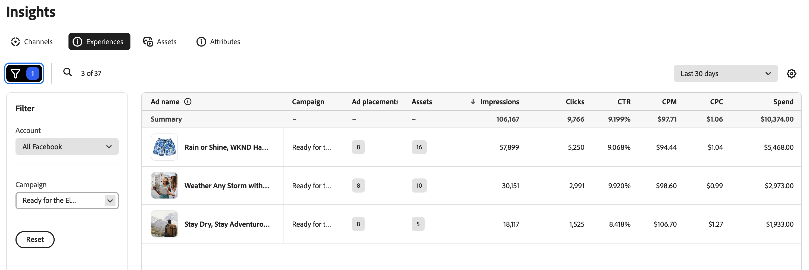

# Panoramica sulle esperienze

La visualizzazione [!DNL Insights] _[!UICONTROL Esperienze]_ mostra un elenco di annunci ed esperienze per l&#39;account annuncio del canale connesso.

La tabella [!UICONTROL Esperienze] è organizzata utilizzando [!UICONTROL Nomi annuncio]. L&#39;icona del filtro (funnel) sopra il lato sinistro della tabella apre il menu **[!UICONTROL Filtro]** in cui è possibile selezionare gli elenchi [!UICONTROL Account] e [!UICONTROL Campaign] per filtrare i nomi degli annunci nella tabella.

## Dettagli annuncio

Quando selezioni un nome di annuncio, puoi visualizzare le metriche e gli attributi delle prestazioni dell’annuncio, che ti consentono di analizzare le metriche di un’esperienza in base al posizionamento dell’annuncio all’interno di un intervallo di date specificato.

La visualizzazione dei dettagli include una metrica complessiva dell&#39;annuncio `click-through rate`, `cost per click` e la quantità di budget `spent` presente nell&#39;annuncio. Poiché gli annunci possono avere più posizionamenti, ad esempio un feed o un banner, puoi visualizzare un raggruppamento delle stesse metriche per ogni posizionamento di annuncio. Utilizza le frecce sinistra e destra in **[!UICONTROL Prestazioni per posizionamento annuncio]** per scorrere le metriche di posizionamento dell&#39;annuncio.

### Attributi di testo

Sotto l&#39;anteprima dell&#39;annuncio è riportato un elenco di [!UICONTROL attributi di testo] associati all&#39;annuncio. Quando le risorse e le esperienze vengono approvate e memorizzate in [!DNL Content], GenStudio for Performance Marketers genera i tag in base alle caratteristiche intrinseche. Per informazioni dettagliate sui metadati di sistema, consulta [Dettagli risorsa](../content/asset-details.md#system-metadata).

### Posizionamenti di annunci

Al momento della creazione di una campagna con Meta Ads, potresti aver selezionato dove eseguire gli annunci in base alla campagna [obiettivo](channels.md#objectives). I posizionamenti di annunci ampliano la portata del pubblico per l’annuncio.

GenStudio for Performance Marketers supporta formati di annunci, come feed di risorse, annunci di collegamenti e immagini o video singoli. Di seguito è riportato un elenco di formati di annunci per piattaforma:

| Instagram | Facebook/Meta | Messenger | Audience Network |
| --- | --- | --- | --- |
| Esplora Esplora Home Esplora Home Griglia Feed Rulli Feed Profilo Cerca Acquista Storie | Esplora aziende Feed Video in streaming Marketplace Reels Sovrapposizione bobine Colonna destra Cerca Storie Feed video Annunci su bobine Facebook | Casella in entrata Storie | Video nativo, banner e interstiziale nativo premiato |

## Metriche

Le metriche di Insights possono aiutarti a valutare quali esperienze contribuiscono al successo di una campagna e quali posizionamenti di annunci sono più efficaci.

### Dettagli delle metriche

La tabella seguente fornisce definizioni e informazioni approfondite per le metriche chiave del marketing digitale nella visualizzazione [!UICONTROL Esperienze]. Ogni metrica include una breve definizione relativa ai nomi degli annunci, al modo in cui viene calcolata la metrica e una o più informazioni utili per comprenderne il significato e l’impatto su un’esperienza.

| Metrica | Definizione | Insight |
| ---------------------- | ----------------------------- | -------------------------------- |
| **[!UICONTROL Campagna]** | Una campagna è un insieme di esperienze e annunci progettati per raggiungere un obiettivo specifico. | |
| **[!UICONTROL Posizionamenti di annunci]** | Numero di posizionamenti di annunci per l’annuncio o l’esperienza. | Il posizionamento degli annunci aumenta la portata del pubblico. |
| **[!UICONTROL Assets]** | Un conteggio delle risorse utilizzate nell’annuncio o nell’esperienza. | |
| **[!UICONTROL Impression]** | Le impression vengono conteggiate ogni volta che il contenuto viene caricato sullo schermo, indipendentemente dall’interazione o dalla visualizzazione. | Un conteggio elevato delle impression può indicare un’ampia visibilità, ma per informazioni approfondite sulle prestazioni, considera con altre metriche di coinvolgimento. |
| **[!UICONTROL Clic]** | Numero di volte in cui gli utenti interagiscono con un elemento cliccabile in un annuncio. I clic possono includere clic su un profilo di pagina o un’immagine, reazione di post, condivisioni, commenti o per espandere i file multimediali a schermo intero. | Un numero elevato di clic indica un forte interesse e coinvolgimento per il contenuto, che può essere efficace e raggiungere il pubblico giusto. |
| **[!UICONTROL CTR]** | Percentuale (%) di utenti che hanno fatto clic su un annuncio. **Calcolo**: `clicks` diviso per `impressions` | Un elevato tasso di click-through indica che il contenuto è altamente pertinente e motivante per il pubblico nella messaggistica e nella progettazione, e sta mirando in modo efficace agli interessi del pubblico. |
| **[!UICONTROL CPM]** | Misurazione delle prestazioni per il costo ($) per mille ad impression. **Calcolo**: importo totale `spent` diviso per la portata, quindi moltiplicato per 1000 | Un valore basso può indicare una visibilità a costi contenuti, soprattutto se associata a un elevato tasso di click-through. |
| **[!UICONTROL CPC]** | Costo medio ($) associato a ogni clic in un’esperienza. **Calcolo**: importo totale `spent` diviso per `clicks` | Costi medi più bassi possono indicare una spesa pubblicitaria efficiente in termini di costi, soprattutto se confrontata con un aumento delle conversioni. |
| **[!UICONTROL Spesa]** | L&#39;importo speso dal bilancio in un determinato periodo di tempo. | Un importo di spesa elevato in un breve periodo può indicare un utilizzo rapido, che potrebbe portare a un precoce esaurimento delle risorse. Monitora l’importo della spesa rispetto alle metriche delle prestazioni chiave per monitorare il ritorno complessivo sull’investimento. |
